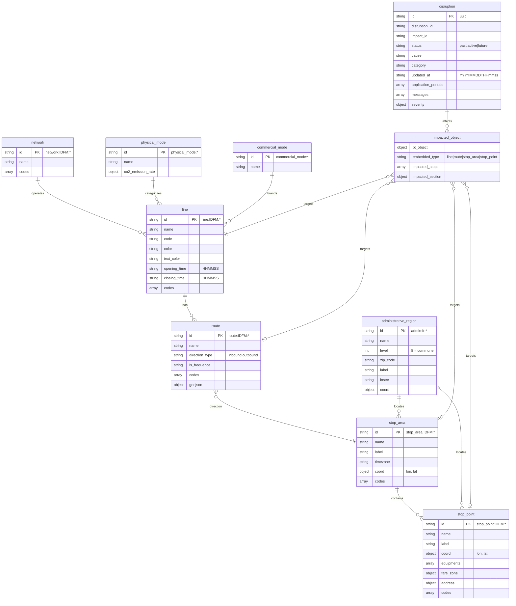

# IDFM Navitia API - Data Model (MCD)

Data model for the Île-de-France Mobilités public transport API (Navitia).

## Entity-Relationship Diagram



## Entities

### network
Transport network operator.

| Field | Type | Example |
|-------|------|---------|
| id | string | `network:IDFM:Operator_043` |
| name | string | `ADP` |
| codes | array | `[{type: "source", value: "FR1:Operator:043:LOC"}]` |

### physical_mode
Physical transport mode with environmental data.

| Field | Type | Example |
|-------|------|---------|
| id | string | `physical_mode:Metro` |
| name | string | `Métro` |
| co2_emission_rate | object | `{value: 3.8, unit: "gEC/Km"}` |

**Values**: Bus, Metro, Tramway, RER (RapidTransit), Train, LocalTrain, Funicular, RailShuttle

### commercial_mode
Branded transport mode (user-facing).

| Field | Type | Example |
|-------|------|---------|
| id | string | `commercial_mode:Bus` |
| name | string | `Bus` |

### line
A public transport line.

| Field | Type | Example |
|-------|------|---------|
| id | string | `line:IDFM:C00563` |
| name | string | `CDG VAL` |
| code | string | `CDG VAL` |
| color | string | `5CC5ED` |
| text_color | string | `FFFFFF` |
| opening_time | string | `000000` |
| closing_time | string | `235959` |
| network | object | embedded network |
| commercial_mode | object | embedded |
| physical_modes | array | embedded |
| routes | array | embedded routes |

### route
A directed path on a line (e.g., "towards Terminal 1").

| Field | Type | Example |
|-------|------|---------|
| id | string | `route:IDFM:ADP:5340-C00563-2` |
| name | string | `Terminal 1` |
| direction_type | string | `inbound` |
| is_frequence | string | `False` |
| direction | object | stop_area (embedded) |
| line | object | parent line (embedded) |

### stop_area
A named zone grouping multiple stop points (e.g., a metro station).

| Field | Type | Example |
|-------|------|---------|
| id | string | `stop_area:IDFM:63978` |
| name | string | `1 Route Nationale` |
| label | string | `1 Route Nationale (La Queue-les-Yvelines)` |
| timezone | string | `Europe/Paris` |
| coord | object | `{lon: "1.774671", lat: "48.804955"}` |
| administrative_regions | array | embedded |

### stop_point
A specific platform or quay where vehicles stop.

| Field | Type | Example |
|-------|------|---------|
| id | string | `stop_point:IDFM:31481` |
| name | string | `1 Route Nationale` |
| label | string | `1 Route Nationale (La Queue-les-Yvelines)` |
| coord | object | `{lon: "1.77469", lat: "48.805"}` |
| stop_area | object | parent stop_area (embedded) |
| administrative_regions | array | embedded |
| equipments | array | `[]` |
| fare_zone | object | `{name: "5"}` |
| address | object | `{id, name, house_number, coord, label}` |

### administrative_region
Administrative division (commune, department, etc.).

| Field | Type | Example |
|-------|------|---------|
| id | string | `admin:fr:78513` |
| name | string | `La Queue-les-Yvelines` |
| level | int | `8` (commune level) |
| zip_code | string | `78940` |
| label | string | `La Queue-les-Yvelines (78940)` |
| insee | string | `78513` |

### disruption
Service disruption or incident affecting transport.

| Field | Type | Example |
|-------|------|---------|
| id | string | `f0a9c390-9908-11f0-a3cb-0a58a9feac02` |
| disruption_id | string | `f0a9633c-9908-11f0-a3cb-0a58a9feac02` |
| impact_id | string | same as id |
| status | string | `active` |
| cause | string | `travaux` |
| category | string | `Incidents` |
| updated_at | string | `20250924T074012` |
| severity | object | `{name, effect, color, priority}` |
| messages | array | `[{text, channel}]` |
| application_periods | array | `[{begin, end}]` |
| impacted_objects | array | embedded |

**severity.effect values**: `SIGNIFICANT_DELAYS`, `NO_SERVICE`, `REDUCED_SERVICE`, `MODIFIED_SERVICE`, `ADDITIONAL_SERVICE`, `DETOUR`, `OTHER_EFFECT`, `UNKNOWN_EFFECT`

## Example: Full Disruption

```json
{
  "id": "f0a9c390-9908-11f0-a3cb-0a58a9feac02",
  "status": "active",
  "cause": "travaux",
  "category": "Incidents",
  "severity": {
    "name": "perturbée",
    "effect": "SIGNIFICANT_DELAYS",
    "color": "#EF662F",
    "priority": 30
  },
  "application_periods": [
    {"begin": "20250924T073800", "end": "20251121T235900"}
  ],
  "messages": [
    {
      "text": "<p><strong>InfoTrafic - Ligne 8...</strong></p>",
      "channel": {"content_type": "text/html", "name": "moteur"}
    }
  ],
  "impacted_objects": [
    {
      "pt_object": {
        "id": "line:IDFM:C00297",
        "embedded_type": "line",
        "line": {
          "id": "line:IDFM:C00297",
          "name": "8",
          "code": "8",
          "color": "6E491E",
          "network": {"id": "network:IDFM:1054", "name": "Argenteuil - Boucles de Seine"}
        }
      }
    }
  ]
}
```

## API Response Envelope

All endpoints return a common structure:

```json
{
  "pagination": {
    "total_result": 2004,
    "start_page": 0,
    "items_per_page": 1000,
    "items_on_page": 1000
  },
  "context": {
    "timezone": "Europe/Paris",
    "current_datetime": "20251102T125323"
  },
  "disruptions": [],
  "links": [],
  "<entity_name>": []
}
```

## Cardinalities Summary

| Relationship | Cardinality |
|--------------|-------------|
| network → line | 1:N |
| physical_mode → line | 1:N |
| commercial_mode → line | 1:N |
| line → route | 1:N |
| route → stop_area (direction) | N:1 |
| stop_area → stop_point | 1:N |
| admin_region → stop_area | 1:N |
| admin_region → stop_point | 1:N |
| disruption → impacted_object | 1:N |
| impacted_object → pt_object | N:1 |
